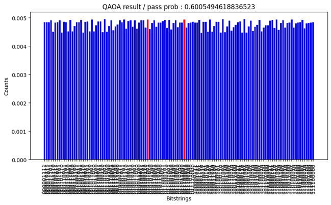

# **Pasqal Challenge - RL QAA Simulation Code**

Welcome to the **Pasqal Challenge** simulation code page.

---


## **📌 Code Overview: Optimizing Renewable Energy Distribution Using Quantum Computing**

### **Table of Contents**
**01_Introduction.ipynb : Characteristics of Renewable Energy Data**

   - How to define QUBO matrix with the data in our problem

   - Various properties of our problem setting

**02_Results.ipynb : Quantum Computing Approaches for Optimization**

   - RL-QAOA: Previous Methodology
   
   - Advancements: Constraint RL-QAOA & RL-QAA

---

## **Reinforcement learning Quantum Adiabatic Algorithm (RL QAA) for Constraint QUBO Problems**

### **Why RL QAA?**
Reinforcement Learning-assisted **Reinforcement learning Quantum Adiabatic Algorithm (RL QAA)** is an enhanced method for solving constraint-based QUBO problems.  
While **QAOA** has been widely used for combinatorial optimization, we observed **severe limitations** when applying it to **portfolio optimization**,  
which involves **constraint QUBO problems**.

In our experiments, **RL QAOA failed to produce meaningful probability distributions**. Instead of focusing on the optimal solution,  
QAOA **equally distributed probability mass among all constraint-satisfying solutions**, making it **impossible for AI learning to progress**.

🚨 **Key Issue:** **QAOA layers do not prioritize optimal solutions, leading to ineffective reinforcement learning.**

**However, replacing the QAOA layer with a Quantum Adiabatic (QA) layer significantly improved performance.**

---

## **📌 Constraint QUBO in Portfolio Optimization**
The problem we are solving falls under **Mean-Variance Optimization (MVO)**, which is a fundamental approach in **portfolio optimization**.

### **Mean-Variance Optimization (MVO)**
MVO is used to construct a portfolio that **maximizes returns while minimizing risk**.  
This is typically formulated as a **constraint-based QUBO problem**, where:
- The **objective function** represents a trade-off between **expected returns and risk (variance)**.
- The **constraints** ensure valid portfolio allocations (e.g., selecting a fixed number of assets).

📌 **Key Challenge:**  
When using **QAOA layers** to optimize this QUBO formulation, we found that the probability distribution **failed to highlight optimal portfolios**.

### **🔹 Why QAOA Fails for Constraint QUBO**
1. **QAOA assigns equal probability to all constraint-satisfying solutions**  
   - This prevents AI from distinguishing between optimal and suboptimal portfolios.
   - Reinforcement learning **fails to converge** due to meaningless probability updates.

2. **QAOA does not effectively guide the learning process**  
   - The algorithm **cannot reinforce the best solutions**, making learning **inefficient and unstable**.

🚨 **Solution:** **Switching from QAOA to QA layers for enhanced performance.**

---

## **🔹 Replacing QAOA with QA Layers**
To overcome these challenges, we **replaced the QAOA layer with a QA (Quantum Adiabatic) layer**,  
which **follows an adiabatic evolution to identify optimal solutions more effectively**.

### **🔬 Experimental Results**
1. **Significant improvement in solution quality**  
   - QA layers **amplify the probability of optimal portfolios**,  
     unlike QAOA, which spreads probability mass evenly across constraint-satisfying solutions.

2. **Faster convergence in RL training**  
   - RL QAA allows reinforcement learning to **prioritize the best portfolios**, leading to **faster and more stable training**.

3. **Superior performance for constraint-based QUBO problems**  
   - Unlike QAOA, QA layers **naturally fit into adiabatic evolution**,  
     making them **better suited for portfolio optimization and constraint QUBO applications**.

---

## **🔹 Why Directly Implementing Arbitrary QUBO on Neutral Atom Systems is Impossible**
One of the key challenges in leveraging **neutral atom quantum computing** for constraint QUBO problems  
is that **arbitrary QUBO Hamiltonians cannot be directly implemented** on the hardware.

### **🚫 Why Can't We Directly Encode QUBO on Neutral Atoms?**
- **Neutral atom quantum processors** typically rely on **Rydberg interactions** in a **2D spatial layout**.
- However, an **arbitrary QUBO problem requires fully connected interactions**, which **cannot be directly mapped onto a 2D neutral atom system**.
- Even in **moderate-sized problems (e.g., a 4×4 constraint QUBO)**, direct implementation **becomes infeasible due to spatial constraints**.

### **🔹 Why We Couldn't Simulate the Problem in Pulser**
Since **Pulser (Pasqal’s quantum simulation library)** only supports **physically realizable Hamiltonians**,  
it **does not allow direct simulation of an arbitrary QUBO problem**.

🚨 **Key Limitation:**  
Pulser **cannot be used for adiabatic QUBO optimization unless the problem fits within a native Rydberg interaction structure.**

---

## **🔹 Our Solution: Custom Adiabatic QUBO Simulation**
Since Pulser **could not directly simulate arbitrary QUBO problems**,  
we developed a **custom simulation framework** that allows us to run **adiabatic quantum optimization**  
for any **constraint QUBO problem**.

### **📌 How We Implemented Our Custom Simulator**
- We designed a **generalized adiabatic evolution framework** that can:
  - **Dynamically evolve QUBO Hamiltonians** in a way that mirrors **adiabatic quantum computing**.
  - **Simulate large-scale constraint QUBO problems** beyond the limitations of Pulser.
- This **custom simulator** allows us to **fully analyze the performance of RL QAA**,  
  even in cases where Pulser **cannot natively support the problem**.

🚀 **Key Benefit:**  
Now, we can **test and validate RL QAA on arbitrary constraint QUBO problems**,  
paving the way for **future experimental implementations on real quantum hardware.**


---

## **🔹 MWIS-Based Implementation for Future Hardware**
Although we **cannot directly implement arbitrary QUBO problems** on current neutral atom hardware,  
**a novel approach using Maximum Weighted Independent Sets (MWIS) has been proposed.**

### **MWIS-Based Approach for Real Hardware Implementation**
- **MWIS methods** allow **constraint QUBO problems to be mapped onto neutral atom processors**.
- By **introducing ancilla qubits**, we can **indirectly encode QUBO weights** while preserving the system's physical constraints.
- This approach has been studied in **recent quantum research**, showing that:
  - **Neutral atom quantum processors can solve arbitrary QUBO problems using MWIS formulations**.
  - **Experimental implementations will be feasible on future hardware generations**.


📌 **Reference:**  
Nguyen *et al.*, *Phys. Rev. A* **107**, 022414 (2023). [DOI: 10.1103/PhysRevA.107.022414](https://link.aps.org/doi/10.1103/PhysRevA.107.022414)


🚀 **Future Goal:**  
Using this method, **RL QAA can be experimentally implemented on real neutral atom quantum devices,  
providing a practical quantum advantage for constraint QUBO problems.**

---

## **📊 QAOA vs. QA Layer Results**
Below are the **visualized results** comparing **QAOA vs. QA Layer probability distributions** for portfolio optimization:

---

**QAOA Probability Distribution:**
- The output **distributes probability evenly** across constraint-satisfying portfolios.
- This results in **ineffective learning**, as AI cannot distinguish between optimal and suboptimal choices.




---

**QA Layer Probability Distribution:**
- The probability mass is **focused on the optimal solutions**.
- AI learning can now **reinforce** the best portfolios and improve training efficiency.


---

## **🚀 Final Takeaway: Why RL QAA is the Future**
- **QAOA fails to optimize constraint QUBO problems** due to uniform probability distributions.
- **Replacing QAOA with QA layers dramatically improves optimization performance**.
- **RL QAA provides a more stable and efficient reinforcement learning framework for portfolio optimization**.
- **Custom simulation tools enabled full QUBO adiabatic simulations, overcoming Pulser’s limitations**.
- **MWIS-based methods will allow real hardware implementation of RL QAA in the future**.

---


## **How to Use the Simulation Code**


### **1. Clone the repository:**  
   ```bash
   git clone https://github.com/your-username/pasqal-challenge.git
   cd pasqal-challenge
